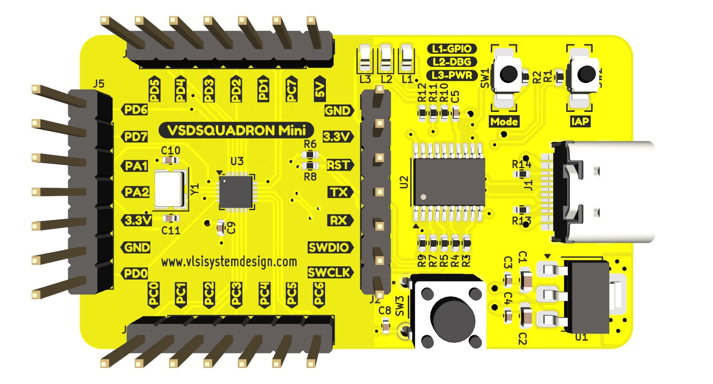
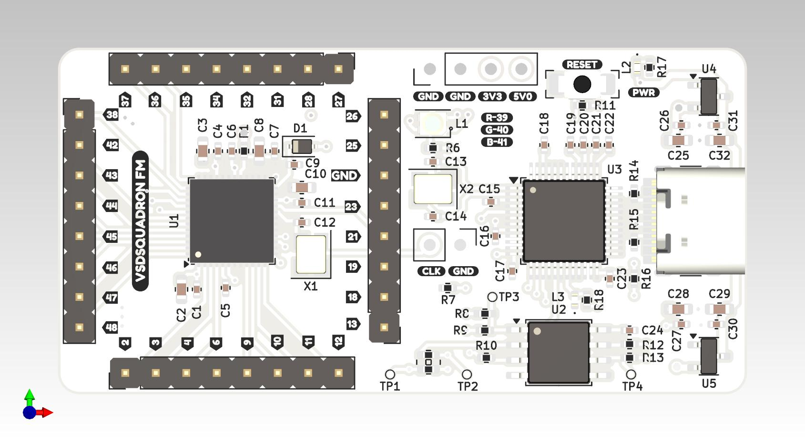
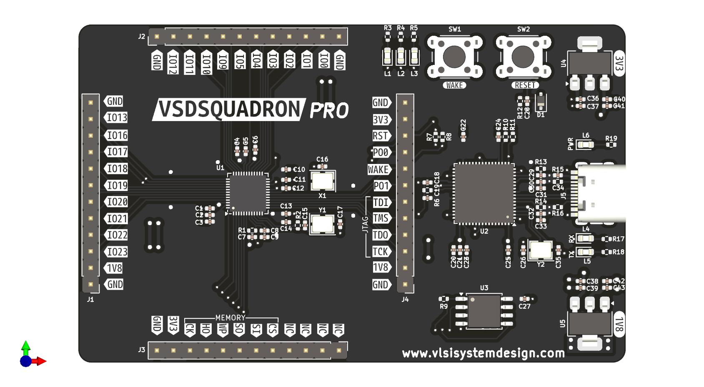

# VSDSquadron

This repository is a collection of the VSDSquadron development boards. It contains the description of each board and the associated schematics.

## VSDSquadron SKY130

The Software for VSDSquadron can be found at [https://github.com/vsdip/vsdsquadron](https://github.com/vsdip/vsdsquadron)

](VSDSquadron_SKY130/squadron_sky130_TOP.jpg)

## VSDSquadron Mini

The Software for VSDSquadron Mini can be found at [https://github.com/vsdip/vsdsquadron_pio](https://github.com/vsdip/vsdsquadron_pio)

](VSDSquadron_Mini/squadron_mini_TOP.jpg)

## VSDSquadron FM

](VSDSquadron_FM/squadron_FM_TOP.jpg)

## VSDSquadron PRO

](VSDSquadron_Pro/squadron_pro_TOP.jpg)

## VSDSquadron Ultra

](VSDSquadron_Ultra/squadron_ultra_TOP.jpg)