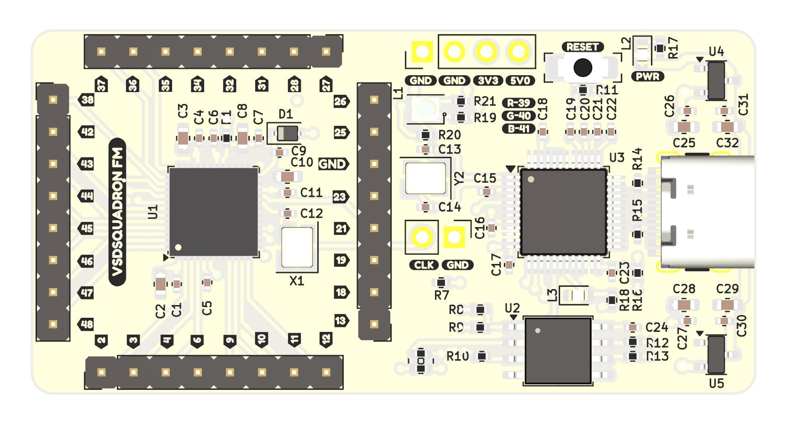
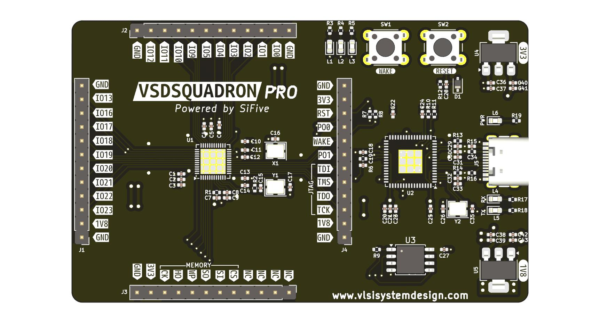
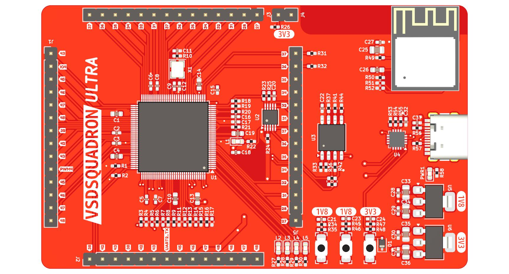

# VSDSquadron

This repository is a collection of the VSDSquadron development boards. It contains the description of each board and the associated schematics.

## VSDSquadron SKY130

The Software for VSDSquadron can be found at [https://github.com/vsdip/vsdsquadron](https://github.com/vsdip/vsdsquadron)

## VSDSquadron Mini

The Software for VSDSquadron Mini can be found at [https://github.com/vsdip/vsdsquadron_pio](https://github.com/vsdip/vsdsquadron_pio)

## VSDSquadron FM

The Software for VSDSquadron Mini can be found at [https://github.com/VSDSquadron/VSDSquadron_FM](https://github.com/VSDSquadron/VSDSquadron_FM)

## VSDSquadron PRO

## VSDSquadron Ultra

## Board Versioning Notice

Please refer to the serial number on the back of your board to identify the version and its changes.

### VSDSquadron Mini

| Serial Number        | Version | Changes from Previous Version                   |
|----------------------|---------|-------------------------------------------------|
| 20241101_J, 20240223_J | 1       | Initial version                                |
| 20241225_J           | 2       | Increased pinout size to fit on perf board       |

### VSDSquadron

| Serial Number | Version | Changes from Previous Version                                                                 |
|---------------|---------|-----------------------------------------------------------------------------------------------|
| 20241201_J    | 1       | Initial version                                                                                |
| 20250321_J    | 2       | ICE clock changed to 12 MHz (from 25 MHz),RGB LEDs now have separate resistors per channel (was one shared resistor) |

