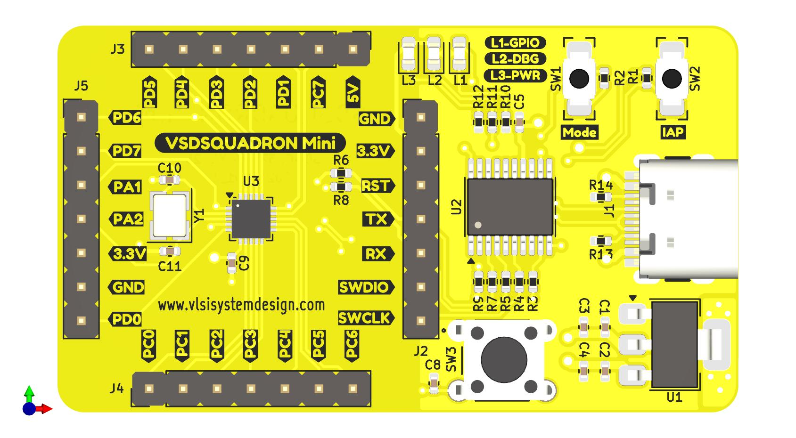
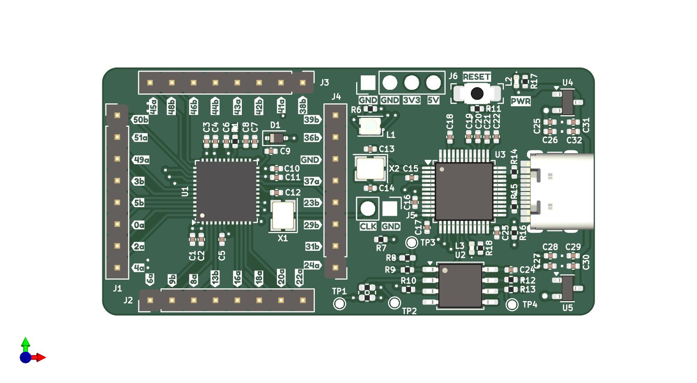

# VSDSquadron

This repository is a collection of the VSDSquadron development boards. It contains the description of each board and the associated schematics.

## VSDSquadron_openMPW

## VSDSquadron_gf180

## VSDSquadron_mini

## VSDSquadron_miniProgrammer

## VSDSquadron_FM

## VSDSquadron_Sifive

